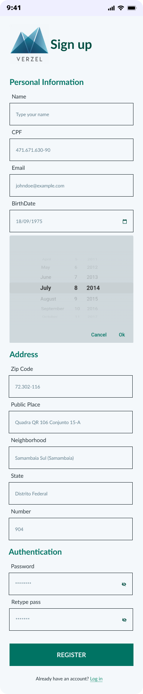
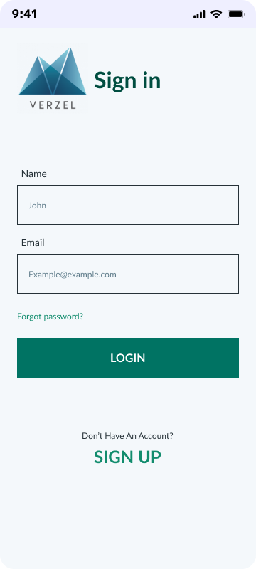
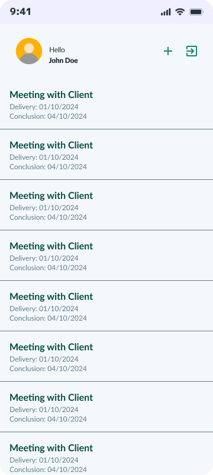
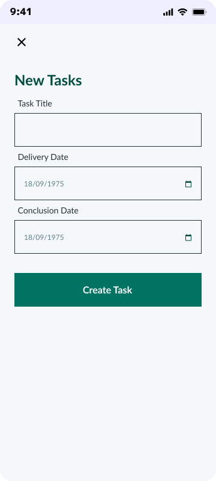
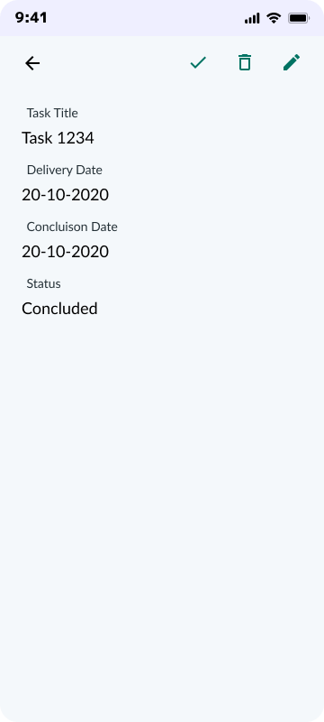

# Verzel Challenges

### Teste Prático Mobile Jr

A proposta desse teste é validar os conhecimentos técnicos em desenvolvimento mobile, lógica de programação e entendimento
da demanda.

<u>**Proposta de Solução**</u>

Desenvolver um app para cadastro de tarefas.

<u>**Tecnologias obrigatórias**</u>
- Flutter
- SQLite

<u>**Requisitos**</u>
- Apenas usuários logados podem cadastrar tarefas;
- Ao abrir o APP deve ter um form de login;
- No form de login, deve ter um link para o form de cadastro;
- Para um usuário se cadastrar, o app deve solicitar (nome, email, data de nascimento, cpf, cep, endereço, numero, senha);
- Os campos nome, email, data de nascimento e senha são obrigatórios os outros são opcionais;
- Apenas usuários maiores de 12 anos podem se cadastrar;
- O campo de CPF deve possuir mascara e validação de CPF;
- O CEP deve ser validado e possuir autocomplete de endereço;
- Após logar no sistema:
- Deve exibir uma listagem de tarefas cadastradas;
- Deve possuir um botão para cadastro de novas tarefas;
- Cada registro da listagem deve possuir as ações (editar, excluir, visualizar, concluir)
- A ação de concluir deve ser apenas para tarefas em aberto (não finalizadas), deve solicitar confirmação para concluir uma
tarefa;
- Deve solicitar uma confirmação para o usuário excluir uma tarefa;
- O cadastro de tarefa deve possuir os campos (nome, data de entrega, data de conclusão);
- Os campos nome e data de entrega são obrigatórios, os outros são opcionais;
- Cada usuário logado deve visualizar apenas as suas tarefas;
- Todos os dados devem ser persistidos localmente no app;
- Escrever no readme os detalhes para setup da aplicação, como configurar e executar;
- Prazo para entrega 5 dias corridos a partir da data de recebimento do teste;

<u>**Diferenciais:**</u>
- Fazer testes unitários dos componentes;

## 🎨 Layout Proposto

  
  
  
  
  
  

